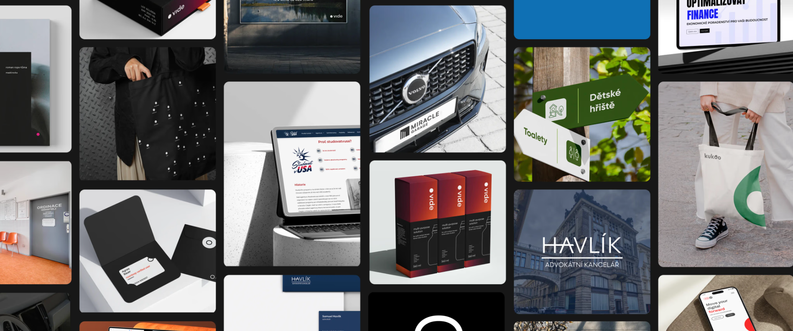

# 👨🏻‍💼 Hi I'm Jacob...
...and this is a complete showcase of my coursework in English class that I've worked out through out this winter semseter. 
Down below you can view a structured list of all my homeworks, thought processes, drafts and final results.

### 🗃️ English Course materials:
#### 1) 📝 First Chapter - "Content first"
This chapter of our English coursework was primarly focused on accesibility in design and writting. More specifically the accesibilty of content in web design and content developement.

* 1.1. [Design of a unique Bespoke Character](bespoke-character.md)
* 1.2. [Design of a visual using our unique Bespoke Charcater](bespoke-character-visual.md)
* 1.3. [Creation and structuring of metadata and Alt text](alt-text.md)

#### 2) 🤝🏻 Second Chapter - "First Impresions"
This chapter of our English coursework was focused on creating public image with

* 2.1. [Design of a personal business card focused on first impresions](business-card.md)
* 2.2. [Development of a profesional e-handshake](e-handshake.md)
* 2.3. [Creation of a personal presentation](personal-presentation.md)

#### 3) 📢 Third Chapter - "Working on speech and presentation skills"
This chapter of our English coursework was focused on our presentation skills and storytelling
* 3.1. ["Today I learned speech"](TDLR.md)
* 3.2. [Project case study](casestudy.md)
* 3.3. [My final presentation](prsentation.md)
 
 

