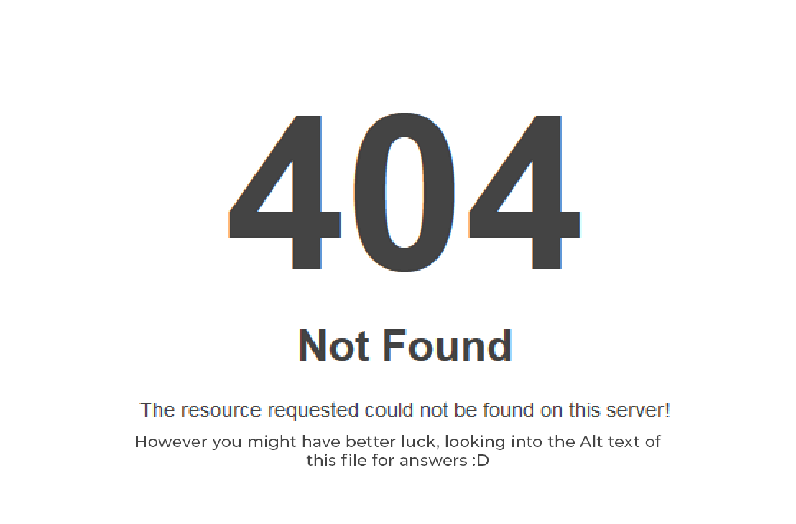

# My final presentation

Hello everyone! Today I'll tell you about my journey with designing my final thesis.

"A branding system for a media company. I wanted to connect all media channels with a system that would work across app, web, social media, video, audio, and print in a consistent way."

"I used to design and iterate as I worked. After a quick round of designing, I arrived at a first concept for a print magazine cover. But then I got stuck on this design for a month, without any breakthrough the whole time. So I chose a different approach."

"I did nothing. I didn't design anything, I didn't sketch anything. I spent all the time thinking about the scale, the way the systems interact, and what their limits are."

"After these 3 months, I decided it was time to move on. And so I did nothing — no design, no sketches, no visualizations."

"I did nothing. I spent all my time just thinking the whole concept through."

"To give you an idea of the timeline, here is a simple graph showing the start and deadline of the final thesis."

"This is how much work I had done so far."

"After six months of designing nothing, I was around here, and most people around me were starting to get nervous (understandably)."

"So after a brief recap, I decided I had given it enough thought to start designing. And it went great, because I knew exactly the limits in every aspect of the design system, so decisions about details were almost automatic. I designed a print magazine system, web system, mobile app system, social media system, and marketing communications in about 3 weeks in total."

"Looking back at my journey, I realized something: at the start, while designing, I was focused only on the doing because I was under the pressure of needing to deliver something. People around me already had their logos and colors, and I was stuck with a seemingly not-so-good idea. But when I focused all my energy on thinking first, it all fell into place. With the availability of design tools becoming more open to beginners, with much smaller learning barriers thanks to AI, I encourage you to think first and design later."

"Though it might be easier to start generating logos right after reading the brief, I would say today — especially when looking at large systematic design problems — we need to think it through very well and very thoroughly. The act of creating (the doing) is no longer as time-consuming as it used to be, thanks to AI. However, just because it is much faster doesn't mean it is free.
TOKENS COST MONEY. AS A DESIGNER, DON'T WASTE THEM ON A FOURTH CONCEPT THAT CAME UP RIGHT AWAY. GIVE IT SOME THOUGHT. THINK IT THROUGH."

"THINK FIRST AND SAVE TOKENS"

"Thank you for having me."

